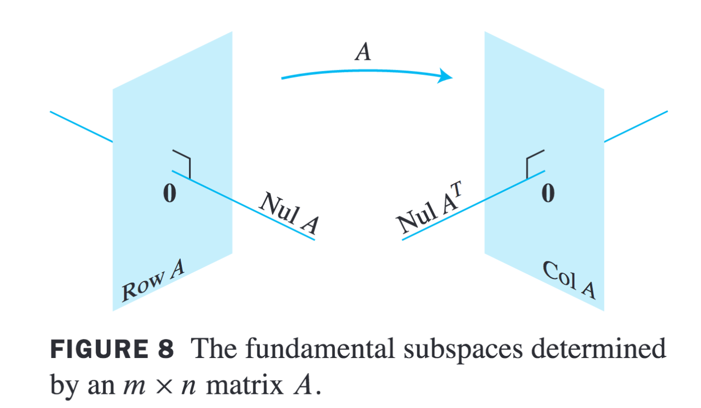
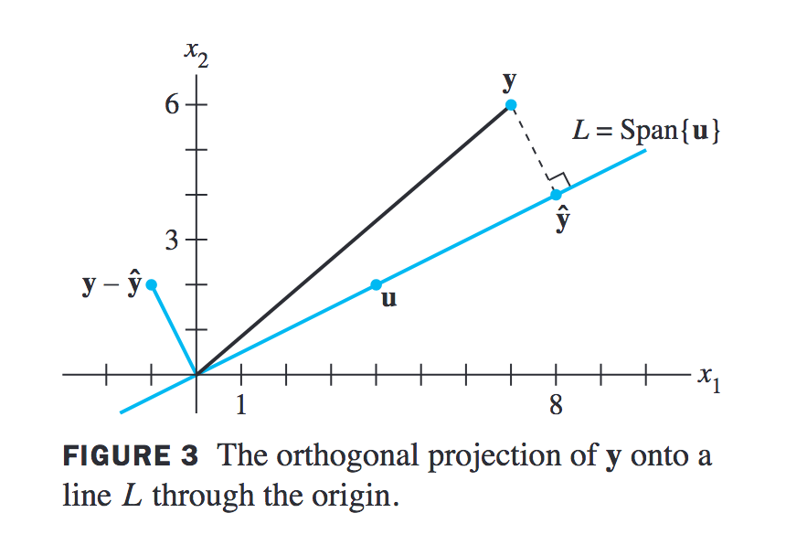

### 참고 도서
- Linear Algebra and its application 5th (Davic C.Lay)

### 선형 방정식 (Linear Equation)
- (Lay Ch1.1에서 다룬다)
- 변수 x1, ..., xn의 선형 방정식은 다음과 같은 형식을 가지는 방정식을 뜻한다. 이때 $a_i,b$는 상수라고 하자.
$$a_1x_1 + a_2x_2 + ... + a_nx_n = b$$
- 선형방정식은 아래와 같이 벡터의 내적(inner product) 형태로도 표현이 가능하다.
$$\begin{bmatrix} a_1 & a_2 & ... &a_n\end{bmatrix}\begin{bmatrix} x_1 \\ x_2 \\ ... \\x_n\end{bmatrix} = a^Tx = b$$
- 선형계(Linear system)은 하나 이상의 선형 방정식을 가리킨다.
$$a_{11}x_1 + a_{12}x_2 + ... + a_{1n}x_n = b_1$$
$$a_{21}x_1 + a_{22}x_2 + ... + a_{2n}x_n = b_2$$
- 선형계는 행렬과 컬럼벡터의 곱으로 표현이 가능하다.
$$\begin{bmatrix} a_{11} & a_{12} & ... &a_{1n}\\a_{21} & a_{22} & ... &a_{2n}\end{bmatrix}\begin{bmatrix} x_1 \\ x_2 \\ ... \\x_n\end{bmatrix} = Ax = b$$

### 벡터 방정식 (Vector Equations)
- (Lay Ch1.3에서 다룬다)
- 벡터 방정식은 $\bold{a_i}, \bold{b}$가 컬럼 벡터(column vector, 간단하게 벡터라고 함)인 방정식을 말한다.
$$x_1\bold{a_1} + x_2\bold{a_2} + ... + x_n\bold{a_n} = \bold{b}$$
- 이때 $\bold{b}$는 $\bold{a_1,...,a_n}$의 선형 결합 (Linear combination)으로 생성되었다고 한다.
- $v_1,..., v_p$가 $\reals^n$에 있을 때, $v_1,..., v_p$의 모든 선형 결합의 집합을 **스팬(Span)** 이라고 한다. 
 

### 선형 독립 (Linear Independence)
- (Lay Ch1.7에서 다룬다)
- 정의:\
$x_1\bold{v_1} + x_2\bold{v_2} + ... + x_p\bold{v_p} = 0$ (이 식을 Homogeneous라고도 부름)가 $\begin{bmatrix} 0\\0\\0\end{bmatrix}$과 같은 Trivial solution (영벡터의 해)만 가진다면 $\bold{v_1,v_2,...,v_p}$는 선형 독립이라고 한다.
- Non-trivial solution (영벡터 이외의 해)를 가진다면 선형 의존 (Linear Dependence)이라고 한다.

### 서브 스페이스 (Subspace)
- (Lay Ch4.1에서 다룬다)
- 벡터의 선형 결합에 닫혀있는 부분집합을 의미한다. 예를 들어 $\bold{u_1, u_2}$의 서브 스페이스는 {$cu_1 + du_2$} 가 된다.

### 널 스페이스, 컬럼 스페이스 (Null space, Column space)
- (Lay Ch4.2에서 다룬다)
- 널 스페이스는 $\bold{A}x=0$ 을 만족시키는 모든 $x$의 집합을 뜻한다. $Nul A$라고 쓴다.
- 컬럼 스페이스는 $\bold{A = \begin{bmatrix} a_1 & a_2 & ... &a_n\end{bmatrix}}$  일 때  A의 컬럼 벡터로 만들수 있는 스팬이다. 즉, $ColA= Span\{\begin{bmatrix} a_1 & a_2 & ... &a_n\end{bmatrix}\}$이다. 

### 기저 벡터 (Basis Vector)
- (Lay Ch4.3에서 다룬다)
- $\bold{B} = \{\bold{b_1,...,b_p}\}$ 가 다음과 같은 성질을 만족한다면 $\bold{B}$를 기저 벡터라고 한다:
  - $\bold{B}$는 선형 독립 집합이다.
  - Span{$\bold{b_1,...,b_p}$}이 완전한 스팬을 이룬다.

### 랭크 (Rank)
- (Lay Ch4.6에서 다룬다)
- $A \in \reals^{m\times n}$의 랭크는 $A$가 가지는 컬럼 스페이스의 차원이다. 즉, $A$의 기저벡터의 수이다.
- RankA = dim (ColA)

### 고유벡터, 고유값 (Eigenvector, Eigenvalue)
- (Lay Ch5.1에서 다룬다)
- 조건: 선형 변환을 위한 행렬 $A$가 정사각행렬이다. 
- 이때, $T(x) = Ax = \lambda x$를 만족하는 $x$를 고유벡터, $\lambda$를 고유값이라고 부른다.
- 행렬과 벡터의 곱을, 스칼라 값과 벡터의 곱으로 바꿔 계산량이 상당히 감소하는 장점이 있다. 
- 고유값은 고유벡터의 방향은 바꾸지 않고, 크기만 바꾸는 성질이 있다.
- 고유벡터로 이루어진 공간을 고유공간 (Eigenspace)라고 한다.
 
- 계산 방법은 $Ax- \lambda x = (A - \lambda I)x = 0$을 만족하는 $\lambda$ 와 $x$를 찾는 것이다.
- 고유벡터, 고유값을 풀기위한 방정식을 특성 방정식 (Characteristic Equation)라고 부르며 $det(A - \lambda I)x=0$ 으로 표현한다.

### 대각화 (Diagonalization)
- (Lay Ch5.3에서 다룬다)
- 조건: 행렬 $A \in \reals^{n \times n}$이고 n개의 고유벡터를 가지면 대각화가 가능하다.
- $D = V^{-1}AV$ ==> $AV = VD$. V는 고유벡터를 컬럼벡터로 가지는 행렬이고 D는 고유값을 대각선의 성분으로 가지는 행렬이다.
- 이 식을 다르게 표현하여 $A = VDV^{-1}$로 쓰면 이를 고유분해 (Eigen decomposition)이라고 한다.
- 기하적 중복도(Geometric multiplicity)와 대수적 중복도(Algebric multiplicity)라는 개념이 있다. 기하적 중복도는 고유공간의 차원을 의미한다. 대수적 중복도는 특성 방정식에서 $\lambda$의 근의 개수다. 행렬 $A$의 기하적 중복도와 대수적 중복도가 같을 때 대각화가 가능하다고 한다.

### 고유벡터와 선형 변환 (Eigenvectors and Linear Transformations)
- (Lay Ch5.4에서 다룬다)
- 이 장에서는 $Ax$를 고유벡터들의 선형결합으로 표현하는 방법을 다룬다. 
- 직교화 성질을 사용하여 $Ax$를 다음과 같이 표현 가능하다
$$Ax = V(D(V^{-1}x))$$
- 왼쪽부터 의미를 살펴보면 $V^{-1}x$는 고유벡터들을 기저로 가지는 평행사변형에서의 $x$의 좌표다. (Change of basis)
- $y = V^{-1}x$라고 하면 $Dy$는 $y$의 값을 각각의 고유값으로 곱한 결과가 된다.
- 마지막으로 $z = Dy$라고 하면 $Vz$는 선형변환을 통해 다시 직교 좌표계로 돌아오는 것을 의미한다. (Change of basis)
- 이 방법으로 $A^k$의 계산량을 상당히 줄일 수 있다. 의미는 기저변환 (Change of basis)을 앞뒤로 한번씩만 하고 diagonal scaling을 여러번 하는 것으로 해석할 수 있다.
$$A^k = VD^kV^{-1}$$

### 직교 여공간 (Orthogonal Complements)
- (Lay Ch6.1에서 다룬다)
 
- $NulA \bot RowA$과 $NulA^T \bot ColA$라는 성질을 **직교 여공간**이라고 한다. 이유는 직교하는 두 공간이 전체공간의 차원을 양분하기 때문이다.
  
### 직교집합 (Orthogonal set)
- (Lay Ch6.2에서 다룬다)
- 직교 집합은 {$u_1,...,u_v$} 공간에서 어떤 두 벡터를 선택해도 $u_i\cdot u_j =0$을 만족하는 집합을 의미한다.
- 직교 정규 집합(Orthonormal set)은 단위 벡터(unit vector)로 이뤄진 직교 집합을 의미한다.
- 직교 기저 (Orthogonal basis)와 직교 정규 기저 (Orthonormal basis)는 각각의 집합 성질을 만족하는 기저 벡터를 의미한다.
- 벡터 $y$에서 직선 L로의 정사영(Orthogonal projection)은 아래 그림에서 $\hat{y}$를 구하는 문제이다. 크기와 방향을 나눠 생각해 볼수 있다. 먼저 **$\hat{y}$의 크기**는 벡터 $y$의 크기에 $cos\theta$를 곱한 것이라고 생각해보면, $y \cdot u = \parallel y \parallel \parallel u \parallel cos \theta$에서 $\parallel y \parallel cos \theta = $y \cdot u \over \parallel u \parallel$ 를 구할 수 있다. **$\hat{y}$의 방향은** 직선 L 상의 단위 벡터인 $u \over \parallel u \parallel$이다. 따라서, 이 둘을 곱하면 $\hat{y} = {y \cdot u \over {u \cdot u}}\cdot u$로 정리 할 수 있다. 
 
- 벡터 $y$에서 평면 P로의 정사영(Orthogonal projection)은 평면 P의 기저 벡터 $u_1$가 만드는 직선과 기저 벡터 $u_2$가 만드는 직선에 각각 투영한 $\hat{y_1}, \hat{y_2}$ 를 구해 이 둘을 더하는 것으로 풀 수 있다.
 

### 그람-슈미트 직교화 (Gram-Schmidt orthogonalization)
- (Lay Ch6.4에서 다룬다)
- 그람-슈미트 직교화는 직교 기저 또는 직교 정규 기저를 만드는 간단한 알고리즘이다.
- 아래 그림의 예를 보자. $W = Span\{\bold{x_1, x_2}\}$라고 할 때 직교 기저 {$\bold{v_1,v_2}$}를 찾아보자.
 
- 먼저 $\bold{x_1 = v_1}$ 라고 하자. 그리고 $\bold{v_1}$에 직교한 $\bold{v_2}$를 찾으면 된다. $p$를 $\bold{v_1}$에 직교한 백터라고 하면, $\bold{v_2} = \bold{x_2} - p = \bold{x_2} - {x_2 \cdot x_1 \over {x_1 \cdot x_1}}\cdot x_1$ 다.

### QR 분해 (QR Factorization, QR Decomposition)
- (Lay Ch6.4에서 다룬다)
- $A \in \reals^{m \times n}$라고 하고 선형 독립의 성질을 가진다고 하면 $A=QR$로 분해 될 수 있다. 이때 Q는 컬럼 벡터가 직교 정규 기저로 구성된 행렬이고 이는 위에서 설명한 그람-슈미트 직교화로 구할 수 있다. R은 정규 상수로 이루어진 상삼각행렬(upper triangular matrix)다.

### 최소 제곱법 (Least Square)
- (Lay Ch6.5에서 다룬다)
- 조건: 방정식의 수가 변수의 수보다 많은 경우. 이 경우를 over-determined system이라 부른다. 제약조건이 너무 많다는 뜻이다.
- 이러한 조건 하에서 근사적으로 해를 찾기 위해 최소 제곱법을 사용 할 수 있다.
- 두 벡터 $u, v$의 거리를 $dist(u,v) = \parallel u-v \parallel$라고 한다면 근사의 해 $\hat{x} = argmin_x\parallel b-Ax \parallel$ 다. 
- 이는 기하학적으로 봤을 때, $b$가 $Col A$ 에 수직으로 떨어지는 수선의 발 $\hat{b} = A\hat{x}$을 찾는 문제로 볼 수 있다. 
 
- $(b -\hat{b}) \bot A$라는 성질은 $A^T(b -\hat{b})=0$문제로 바꿀 수 있다. 이것을 전개 하면 $A^Tb = A^TA\hat{x}$가 되고 이 방정식을 **정규 방정식(Normal equation)** 이라고 부른다. 

### 특이값 분해 (Singular Value Decomposition)
- (Lay Ch7.4에서 다룬다)
- 고유분해(Eigen decompostion)는 정사각행렬에서만 가능하다. $A \in \reals^{m \times n}$ 인 직사각행렬일 때는 다음과 같이 분해가 가능하다. 이때 $U, V$는 컬럼 벡터들이 직교 정규(Orthonormal)한 성질을 가진다.
$$A = U\Sigma V^T$$
 
- SVD를 계산하기 위해서 먼저 $AA^T$와 $A^TA$를 계산해보자.
$$AA^T = U\Sigma V^TV\Sigma^TU^T = U\Sigma^2U^T$$
$$A^TA = V\Sigma^T U^UV\Sigma V^T = V\Sigma^2V^T$$
- $AA^T$와 $A^TA$는 대칭행렬(Symmetry matrix)다. 대칭행렬은 항상 대각화가 가능(diagonalizable)하며 직교한 성질(orthogonal)을 가진다. 이러한 성질을 **스펙터럼 정리(spectral theorem)**이라고 한다.
- 대칭행렬 S의 고유값이 모두 양(positive)값을 가지면 $x^TSx$를 양의 정부호(positive definite)를 가진다고하고 이때 S를 양의 정부호 행렬(positive definite matrix)이라고 부른다.
- $AA^T$, $A^TA$는 semi positive definite한 성질을 가진다:
$$x^TAA^Tx = (A^Tx)^TA^TX = \parallel A^TX\parallel^2 \geq0$$
$$x^TA^TAx = (Ax)^TAX = \parallel AX\parallel^2 \geq0$$